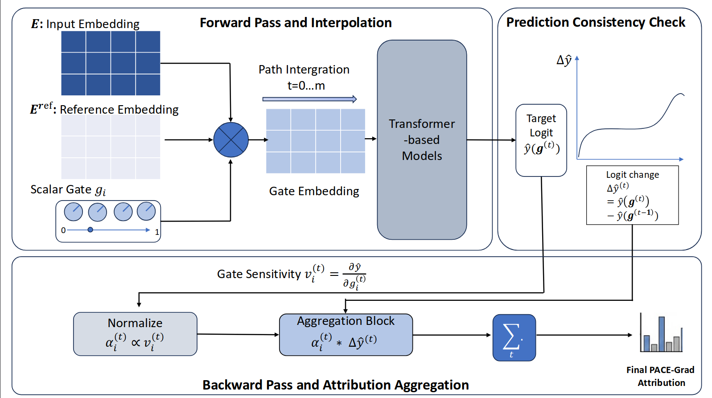

# This repository provide implementation of PACE Gradients: Prediction-Aware Consistency-Enhanced Gated Gradient Attribution 

## Overview Diagram


# How to install and run evaluation for PACE Gradient

* First, create a python environment (preferrably through `conda`) and install necessary requirements

```shell
conda create -n pace_gradient_env python=3.12 -y
conda activate pace_gradient_env
pip install -r requirements.txt
```

* Secondly, run evaluation of `PACE gradient` for BERT on sentiment classification on a selected dataset with the following command:

```bash
python run_eval_pg_sentiment_analysis.py --model [Model name] --dataset [dataset name]
```

Where 
* `[Model name]` is either `distilbert`, `bert`, or `roberta`, 
* `[dataset name]` options are: `sst2`, `rotten`, and `imdb`. 


Example command:
```bash
python run_eval_pg_sentiment_analysis.py --model distilbert --dataset rotten
```

Addtionally to run evaluation for QA Task For BERT model using the scheme introduced by [Uniform Discretized Integrated Gradients](https://arxiv.org/abs/2412.03886) using PACE Gradient, you can use the following commands:

Example command:
```bash
python run_eval_pg_qa.py
```
